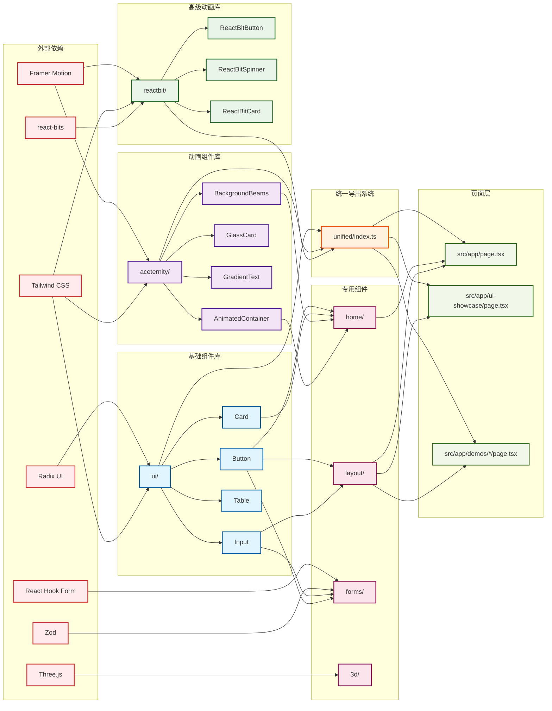
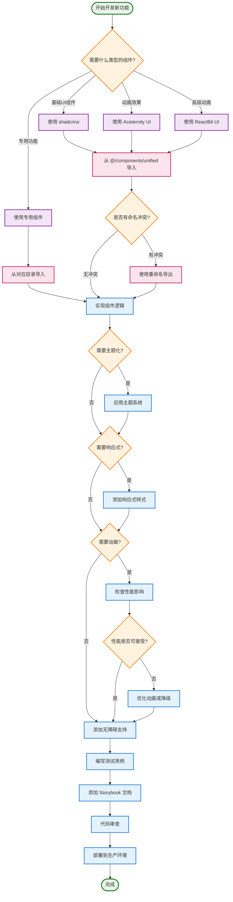

# PraxisGrove 组件库文档

## 📚 概述

PraxisGrove 前端项目采用了模块化的组件架构，集成了三个主要的 UI 组件库，提供了丰富的组件生态系统。本文档详细介绍了项目中所有组件的功能、用法和最佳实践。

### 🎯 组件库架构

```
src/components/
├── ui/                     # shadcn/ui 基础组件库 (50+ 组件)
├── aceternity/             # Aceternity UI 动画组件库 (30+ 组件)
├── reactbit/               # ReactBit UI 高级动画组件库 (20+ 组件)
├── unified/                # 统一导出系统 (解决命名冲突)
├── home/                   # 首页专用组件 (8 个组件)
├── layout/                 # 布局组件 (9 个组件)
├── forms/                  # 表单组件 (12 个组件)
├── 3d/                     # 3D 相关组件 (2 个组件)
├── seo/                    # SEO 组件 (1 个组件)
├── providers/              # 提供者组件 (1 个组件)
├── accessibility/          # 无障碍功能组件 (1 个组件)
└── dev/                    # 开发工具组件 (1 个组件)
```

### 🚀 快速开始

```typescript
// 推荐：使用统一导入系统
import {
  // shadcn/ui 基础组件
  Button, Card, Input, Label,

  // Aceternity UI 动画组件
  BackgroundBeams, AnimatedContainer, GlassCard,

  // ReactBit UI 高级动画组件
  ReactBitButton, ReactBitSpinner, ReactBitText
} from '@/components/unified';

// 使用示例
function MyComponent() {
  return (
    <div>
      <BackgroundBeams />
      <Card>
        <AnimatedContainer animation="slideUp">
          <Label>用户名</Label>
          <Input placeholder="请输入用户名" />
          <Button>提交</Button>
        </AnimatedContainer>
      </Card>
    </div>
  );
}
```

## 🧩 组件库详解

### 1. shadcn/ui 基础组件库 (`/ui`)

**用途：** 提供标准的、可访问的基础 UI 组件  
**特点：** 完整的可访问性支持、一致的设计系统、TypeScript 类型安全、主题系统集成

#### 📋 组件清单

##### 表单组件

- **Button** - 按钮组件，支持多种变体和尺寸
- **Input** - 输入框组件，支持各种输入类型
- **Label** - 标签组件，与表单控件关联
- **Textarea** - 多行文本输入组件
- **Checkbox** - 复选框组件
- **RadioGroup** - 单选按钮组组件
- **Switch** - 开关组件
- **Select** - 下拉选择组件

##### 布局组件

- **Card** - 卡片容器组件，包含 Header、Content、Footer
- **Separator** - 分隔线组件
- **ScrollArea** - 滚动区域组件
- **Tabs** - 标签页组件
- **Accordion** - 手风琴组件
- **Collapsible** - 可折叠组件

##### 反馈组件

- **Alert** - 警告提示组件
- **Badge** - 徽章组件
- **Progress** - 进度条组件
- **Skeleton** - 骨架屏组件
- **Tooltip** - 工具提示组件
- **Toast** - 消息提示组件

##### 导航组件

- **DropdownMenu** - 下拉菜单组件
- **Command** - 命令面板组件
- **Dialog** - 对话框组件
- **Sheet** - 侧边抽屉组件
- **NavigationMenu** - 导航菜单组件

##### 数据展示组件

- **Table** - 表格组件
- **Calendar** - 日历组件
- **Avatar** - 头像组件
- **Chart** - 图表组件

#### 🔧 使用示例

```typescript
import { Button, Card, CardContent, CardHeader, CardTitle } from '@/components/unified';

function BasicExample() {
  return (
    <Card className="w-96">
      <CardHeader>
        <CardTitle>基础表单</CardTitle>
      </CardHeader>
      <CardContent>
        <Button variant="default" size="lg">
          提交表单
        </Button>
      </CardContent>
    </Card>
  );
}
```

### 2. Aceternity UI 动画组件库 (`/aceternity`)

**用途：** 提供高质量的动画和视觉效果组件  
**特点：** 流畅的动画效果、现代化设计、性能优化、主题集成

#### 📋 组件清单

##### 背景效果组件

- **BackgroundBeams** - 光束背景效果
- **ParticleBackground** - 粒子背景效果

##### 导航组件

- **FloatingNav** - 浮动导航栏

##### 动画容器组件

- **AnimatedContainer** - 动画容器，支持多种进入动画
- **AnimatedItem** - 动画项目组件
- **InViewAnimation** - 视口内动画组件
- **HoverAnimation** - 悬停动画组件

##### 特殊效果组件

- **BeamScan** - 光束扫描效果
- **PulseGlow** - 脉冲发光效果
- **Floating** - 浮动效果
- **GradientShift** - 渐变变换效果
- **ParticleEffect** - 粒子效果
- **RippleWave** - 波纹效果

##### 样式组件

- **GlassCard** - 玻璃质感卡片
- **GlowBorder** - 发光边框
- **FloatingShadow** - 浮动阴影
- **GradientText** - 渐变文字
- **EnhancedButton** - 增强按钮
- **EnhancedCard** - 增强卡片
- **EnhancedInput** - 增强输入框

##### 扩展组件

- **HeroSection** - 英雄区域组件
- **FeatureCard** - 功能卡片组件
- **FeatureGrid** - 功能网格组件
- **StatsCounter** - 统计计数器
- **StatsGrid** - 统计网格
- **Timeline** - 时间线组件
- **InteractiveCard** - 交互式卡片

##### 高级动画组件

- **Typewriter** - 打字机效果
- **CountUp** - 数字递增动画
- **FlipCard** - 翻转卡片
- **Magnetic** - 磁性效果
- **RippleEffect** - 高级波纹效果

##### 增强特效组件

- **Parallax** - 视差滚动效果
- **ScrollReveal** - 滚动揭示动画
- **MouseFollower** - 鼠标跟随效果
- **TextSplit** - 文字分割动画
- **LiquidButton** - 液体按钮效果
- **FloatingElement** - 浮动元素
- **AnimatedBorder** - 动画边框
- **ParticleExplosion** - 粒子爆炸效果

#### 🔧 使用示例

```typescript
import {
  BackgroundBeams,
  AnimatedContainer,
  GlassCard,
  GradientText
} from '@/components/unified';

function AnimatedExample() {
  return (
    <div className="relative min-h-screen">
      <BackgroundBeams />
      <AnimatedContainer animation="slideUp" delay={0.2}>
        <GlassCard className="p-6">
          <GradientText className="text-2xl font-bold">
            动画标题
          </GradientText>
        </GlassCard>
      </AnimatedContainer>
    </div>
  );
}
```

### 3. ReactBit UI 高级动画组件库 (`/reactbit`)

**用途：** 提供细粒度控制的高级动画组件  
**特点：** 精确的动画控制、高度可定制、响应式动画、性能优化选项

#### 📋 组件清单

##### 动画组件（重命名避免冲突）

- **ReactBitButton** - 高级动画按钮
- **ReactBitCard** - 高级动画卡片
- **ReactBitText** - 高级动画文字
- **ReactBitIcon** - 高级动画图标
- **ReactBitList** - 高级动画列表
- **ReactBitInput** - 高级动画输入框

##### 背景效果组件

- **ReactBitBackground** - 动画背景
- **ReactBitGradientBackground** - 渐变动画背景
- **ReactBitParticleField** - 粒子场效果

##### 交互组件

- **ReactBitHoverCard** - 悬停交互卡片
- **ReactBitClickEffect** - 点击效果
- **ReactBitScrollAnimation** - 滚动动画

##### 加载组件

- **ReactBitSpinner** - 高级加载动画
- **ReactBitProgressBar** - 动画进度条
- **ReactBitSkeletonLoader** - 动画骨架屏

##### 导航组件

- **ReactBitNavbar** - 动画导航栏
- **ReactBitSidebarMenu** - 动画侧边栏菜单
- **ReactBitTabNavigation** - 动画标签导航

##### 表单组件

- **ReactBitSelect** - 动画选择器
- **ReactBitCheckbox** - 动画复选框

##### 反馈组件

- **ReactBitToast** - 动画消息提示
- **ReactBitModal** - 动画模态框
- **ReactBitAlert** - 动画警告

##### 数据展示组件

- **ReactBitChart** - 动画图表
- **ReactBitTable** - 动画表格
- **ReactBitTimeline** - 动画时间线

#### 🔧 使用示例

```typescript
import {
  ReactBitButton,
  ReactBitCard,
  ReactBitSpinner
} from '@/components/unified';

function AdvancedAnimationExample() {
  return (
    <ReactBitCard
      variant="elevated"
      animation="tilt"
      interactive={true}
    >
      <ReactBitButton
        animation="magnetic"
        variant="primary"
        onClick={() => console.log('点击')}
      >
        磁性按钮
      </ReactBitButton>
      <ReactBitSpinner
        size="lg"
        variant="pulse"
        color="primary"
      />
    </ReactBitCard>
  );
}
```

## 🏠 专用组件模块

### 4. 首页组件 (`/home`)

专门为首页设计的组件模块，包含完整的首页布局和功能组件。

#### 📋 组件清单

- **HeroSection** - 英雄区域，首页主要展示区域
- **FeaturesSection** - 功能特性展示区域
- **ProductIntro** - 产品介绍组件
- **CTASection** - 行动号召区域
- **RoadmapSection** - 路线图展示
- **TestimonialsSection** - 用户评价区域
- **FooterSection** - 页脚组件
- **QuickActions** - 快速操作组件

#### 🔧 使用示例

```typescript
import {
  HeroSection,
  FeaturesSection,
  CTASection
} from '@/components/home';

function HomePage() {
  return (
    <div>
      <HeroSection />
      <FeaturesSection />
      <CTASection />
    </div>
  );
}
```

### 5. 布局组件 (`/layout`)

提供应用程序的整体布局结构和导航组件。

#### 📋 组件清单

- **MainLayout** - 主布局组件
- **ResponsiveLayout** - 响应式布局组件
- **Header** - 页头组件
- **Sidebar** - 侧边栏组件
- **Logo** - 标志组件
- **SvgLogo** - SVG 标志组件
- **LayoutContainer** - 布局容器
- **GridSystem** - 网格系统组件

#### 🔧 使用示例

```typescript
import { MainLayout, Header, Sidebar } from '@/components/layout';

function AppLayout({ children }: { children: React.ReactNode }) {
  return (
    <MainLayout>
      <Header />
      <div className="flex">
        <Sidebar />
        <main className="flex-1">
          {children}
        </main>
      </div>
    </MainLayout>
  );
}
```

### 6. 表单组件 (`/forms`)

提供完整的表单解决方案，包含表单验证、状态管理和各种输入组件。

#### 📋 组件清单

##### 表单提供者和基础组件

- **FormProvider** - 表单上下文提供者
- **FormError** - 表单错误显示组件
- **FormLabel** - 表单标签组件
- **FormField** - 表单字段组件
- **FormSubmit** - 表单提交按钮
- **FormReset** - 表单重置按钮

##### 输入组件

- **TextInput** - 文本输入组件
- **PasswordInput** - 密码输入组件
- **NumberInput** - 数字输入组件
- **TextareaInput** - 多行文本输入组件

##### 选择组件

- **SelectInput** - 单选下拉组件
- **MultiSelect** - 多选下拉组件
- **RadioInput** - 单选按钮组件
- **SwitchInput** - 开关输入组件

##### 文件上传组件

- **FileUpload** - 文件上传组件

#### 🔧 使用示例

```typescript
import {
  FormProvider,
  TextInput,
  SelectInput,
  FormSubmit
} from '@/components/forms';
import { z } from 'zod';

const schema = z.object({
  name: z.string().min(1, '姓名不能为空'),
  email: z.string().email('邮箱格式不正确'),
  role: z.string().min(1, '请选择角色')
});

function UserForm() {
  return (
    <FormProvider
      schema={schema}
      onSubmit={(data) => console.log(data)}
    >
      <TextInput
        name="name"
        label="姓名"
        placeholder="请输入姓名"
      />
      <TextInput
        name="email"
        type="email"
        label="邮箱"
        placeholder="请输入邮箱"
      />
      <SelectInput
        name="role"
        label="角色"
        options={[
          { value: 'admin', label: '管理员' },
          { value: 'user', label: '用户' }
        ]}
      />
      <FormSubmit>提交</FormSubmit>
    </FormProvider>
  );
}
```

### 7. 3D 组件 (`/3d`)

基于 Three.js 和 React Three Fiber 的 3D 组件库。

#### 📋 组件清单

- **KnowledgeGraph** - 3D 知识图谱组件
- **Scene** - 3D 场景组件

#### 🔧 使用示例

```typescript
import { KnowledgeGraph } from '@/components/3d';

function RoadmapPage() {
  return (
    <div className="h-screen">
      <KnowledgeGraph />
    </div>
  );
}
```

### 8. 其他专用组件

#### SEO 组件 (`/seo`)

- **SEOHead** - SEO 头部组件，管理页面元数据

#### 提供者组件 (`/providers`)

- **PerformanceInitializer** - 性能初始化组件

#### 无障碍功能组件 (`/accessibility`)

- **AccessibilityFeatures** - 无障碍功能组件

#### 开发工具组件 (`/dev`)

- **DevTools** - 开发工具组件

## 🔧 统一导出系统 (`/unified`)

为了解决多个组件库之间的命名冲突和依赖管理问题，项目实现了统一导出系统。

### 🎯 解决的问题

1. **命名冲突** - 不同库可能有相同名称的组件
2. **依赖管理** - 简化导入路径和依赖关系
3. **功能重叠** - 避免功能相似的组件混用
4. **主题一致性** - 确保所有组件使用统一的主题系统

### 🚀 使用优先级

```typescript
// 1. 基础UI组件 -> 使用 shadcn/ui
import { Button, Card, Input } from '@/components/unified';

// 2. 动画和特效 -> 使用 Aceternity UI
import { BackgroundBeams, AnimatedContainer } from '@/components/unified';

// 3. 特定动画需求 -> 使用 ReactBit UI
import { ReactBitButton, ReactBitSpinner } from '@/components/unified';
```

### 🔄 命名冲突解决

```typescript
// 重命名导出避免冲突
import {
  // Aceternity UI 重命名
  AceternityTypewriter,
  AceternityRippleEffect,
  AceternityMagnetic,

  // ReactBit UI 重命名
  ReactBitButton,
  ReactBitCard,
  ReactBitText,
} from '@/components/unified';
```

## 📊 组件使用统计

根据项目分析，组件使用情况如下：

### 📈 使用频率排行

#### 高频使用组件 (10+ 次引用)

- **Button** - 基础按钮组件，在多个页面和组件中使用
- **Card** - 卡片组件，用于内容展示和布局
- **Input** - 输入组件，表单和搜索功能中广泛使用
- **AnimatedContainer** - 动画容器，为页面添加动画效果

#### 中频使用组件 (5-10 次引用)

- **BackgroundBeams** - 背景光束效果，用于页面背景
- **GlassCard** - 玻璃质感卡片，用于特殊展示区域
- **MainLayout** - 主布局组件，应用程序框架
- **HeroSection** - 英雄区域，首页和重要页面使用

#### 低频使用组件 (1-5 次引用)

- **ReactBitSpinner** - 高级加载动画，特定场景使用
- **KnowledgeGraph** - 3D 知识图谱，专用功能页面
- **FileUpload** - 文件上传，特定表单中使用

### 📊 组件库使用比例

- **shadcn/ui**: ~60% (基础组件为主)
- **Aceternity UI**: ~30% (动画和特效)
- **ReactBit UI**: ~10% (特定动画需求)

## 🎨 主题和样式系统

### 🌈 主题配置

项目支持统一的主题系统，确保所有组件库的视觉一致性。

```typescript
import { useAceternityTheme } from '@/components/unified';

function ThemedComponent() {
  const { theme } = useAceternityTheme();

  return (
    <div style={{
      backgroundColor: theme.colors.background,
      color: theme.colors.foreground
    }}>
      主题化内容
    </div>
  );
}
```

### 🎭 深色/浅色模式

所有组件都支持深色和浅色模式的自动切换。

```typescript
import { ThemeToggle } from '@/components/unified';

function App() {
  return (
    <div>
      <ThemeToggle />
      {/* 其他组件会自动适应主题 */}
    </div>
  );
}
```

## ⚡ 性能优化

### 🚀 代码分割

组件库实现了智能的代码分割策略：

- **shadcn/ui** 组件单独打包
- **Framer Motion** 动画库单独打包
- **ReactBit UI** 组件单独打包
- **Three.js** 3D 库按需加载

### 📊 性能监控

项目集成了性能监控系统：

```typescript
import { usePerformanceMonitor } from '@/lib/performance-monitor';

function MonitoredComponent() {
  usePerformanceMonitor('ComponentName');

  return <div>被监控的组件</div>;
}
```

### 🎯 性能最佳实践

1. **优先使用统一导入** (`@/components/unified`)
2. **根据需求选择合适的动画复杂度**
3. **在列表中避免过度使用复杂动画**
4. **遵循用户的可访问性偏好**

## 🧪 测试和质量保证

### ✅ 测试覆盖

- **单元测试** - 所有基础组件都有对应的测试用例
- **可访问性测试** - 通过 axe 可访问性检查
- **性能测试** - 渲染性能和内存使用监控
- **E2E 测试** - 关键用户流程的端到端测试

### 📋 质量标准

- **TypeScript 类型安全** - 所有组件都有完整的类型定义
- **可访问性合规** - 遵循 WCAG 2.1 AA 标准
- **响应式设计** - 支持各种屏幕尺寸
- **浏览器兼容性** - 支持现代浏览器

## 🔗 相关文档

- [UI 组件库使用指南](../../docs/UI_LIBRARIES_GUIDE.md)
- [组件最佳实践](../../docs/COMPONENT_BEST_PRACTICES.md)
- [UI 集成总结](../../docs/UI_INTEGRATION_SUMMARY.md)
- [项目设置总结](../../PROJECT_SETUP_SUMMARY.md)

## 🤝 贡献指南

### 📝 添加新组件

1. 在相应的目录下创建组件文件
2. 添加 TypeScript 类型定义
3. 编写单元测试
4. 更新导出文件 (`index.ts`)
5. 如需要，更新统一导出系统
6. 添加 Storybook 文档

### 🔧 组件开发规范

1. **命名规范** - 使用 PascalCase 命名组件
2. **Props 接口** - 为所有 props 定义 TypeScript 接口
3. **默认值** - 为可选 props 提供合理的默认值
4. **可访问性** - 确保组件支持键盘导航和屏幕阅读器
5. **响应式** - 组件应适配不同屏幕尺寸
6. **性能** - 避免不必要的重渲染，使用 React.memo 等优化

### 🎨 样式规范

1. **Tailwind CSS** - 优先使用 Tailwind 类名
2. **CSS 变量** - 使用 CSS 变量实现主题化
3. **响应式** - 使用 Tailwind 的响应式前缀
4. **动画** - 优先使用 Framer Motion 实现动画

### PraxisGrove 组件库层级结构图

```mermaid
graph TD
    A[src/components] --> B[ui/ - shadcn/ui 基础组件库]
    A --> C[aceternity/ - Aceternity UI 动画组件库]
    A --> D[reactbit/ - ReactBit UI 高级动画组件库]
    A --> E[unified/ - 统一导出系统]
    A --> F[home/ - 首页专用组件]
    A --> G[layout/ - 布局组件]
    A --> H[forms/ - 表单组件]
    A --> I[3d/ - 3D 相关组件]
    A --> J[seo/ - SEO 组件]
    A --> K[providers/ - 提供者组件]
    A --> L[accessibility/ - 无障碍功能组件]
    A --> M[dev/ - 开发工具组件]

    B --> B1[Button, Input, Card]
    B --> B2[Table, Dialog, Sheet]
    B --> B3[Accordion, Tabs, Select]
    B --> B4[Progress, Badge, Alert]

    C --> C1[BackgroundBeams, FloatingNav]
    C --> C2[AnimatedContainer, GlassCard]
    C --> C3[PulseGlow, GradientText]
    C --> C4[Typewriter, CountUp]

    D --> D1[ReactBitButton, ReactBitCard]
    D --> D2[ReactBitSpinner, ReactBitText]
    D --> D3[ReactBitInput, ReactBitModal]

    E --> E1[统一导出所有组件]
    E --> E2[解决命名冲突]
    E --> E3[主题系统集成]

    F --> F1[HeroSection, FeaturesSection]
    F --> F2[CTASection, ProductIntro]
    F --> F3[RoadmapSection, FooterSection]

    G --> G1[MainLayout, Header]
    G --> G2[Sidebar, Logo]
    G --> G3[ResponsiveLayout, GridSystem]

    H --> H1[FormProvider, TextInput]
    H --> H2[SelectInput, FileUpload]
    H --> H3[FormValidation, FormSubmit]

    I --> I1[KnowledgeGraph]
    I --> I2[Scene]

    J --> J1[SEOHead]
    K --> K1[PerformanceInitializer]
    L --> L1[AccessibilityFeatures]
    M --> M1[DevTools]

    classDef primaryLib fill:#e1f5fe,stroke:#01579b,stroke-width:2px
    classDef animationLib fill:#f3e5f5,stroke:#4a148c,stroke-width:2px
    classDef advancedLib fill:#e8f5e8,stroke:#1b5e20,stroke-width:2px
    classDef unifiedLib fill:#fff3e0,stroke:#e65100,stroke-width:2px
    classDef specialLib fill:#fce4ec,stroke:#880e4f,stroke-width:2px

    class B,B1,B2,B3,B4 primaryLib
    class C,C1,C2,C3,C4 animationLib
    class D,D1,D2,D3 advancedLib
    class E,E1,E2,E3 unifiedLib
    class F,G,H,I,J,K,L,M,F1,F2,F3,G1,G2,G3,H1,H2,H3,I1,I2,J1,K1,L1,M1 specialLib
```



### PraxisGrove 组件依赖关系图



### PraxisGrove 组件使用流程图



---

**最后更新：** 2025-07-20
**版本：** 1.0.0
**维护者：** PraxisGrove 开发团队
